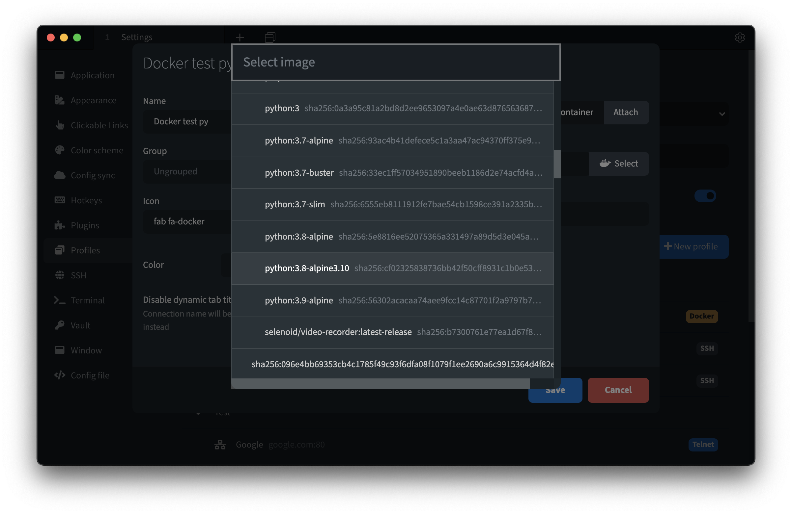
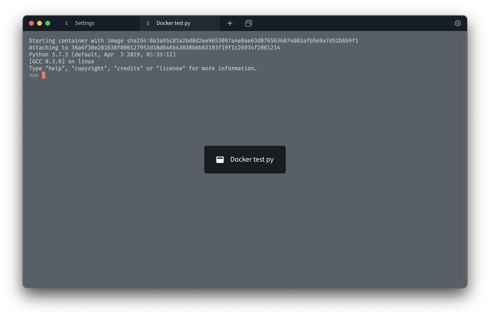

# Docker plugin for Tabby Terminal

This plugin lets you shell right into running Docker containers and start new ones.

You can connect to a running container through the profile selector, or create a new profile from the `Docker container shell` profile template and then select an image and/or custom shell command.

